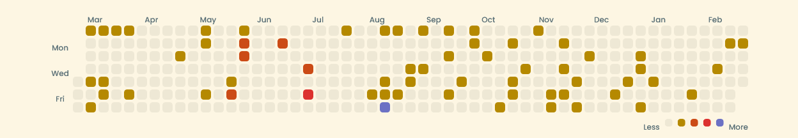

# :octocat: GitHub Contribution Chart Generator

The GitHub Contribution Chart Generator is a web application that allows users to create a customized visualization of their GitHub contribution history. By generating an image of all your GitHub contributions for last one year, you can share your coding activity on social media or personal websites.

<p align="center">
   
   
   
</p>

## Installation

To run the application locally, follow these steps:

1. **Clone the Repository**:

   ```bash
   git clone https://github.com/mrnikhilsingh/github-contribution-chart.git
   ```

2. **Navigate to the Project Directory**:

   ```bash
   cd github-contribution-chart
   ```

3. **Install Dependencies**:

   ```bash
   npm install
   ```

4. **Start the Development Server**:

   ```bash
   npm run dev
   ```

The application will be accessible at `http://localhost:5173`.

## Usage

1. **Enter Your GitHub Username**: On the homepage, input your GitHub username.
2. **Select a Theme**: Choose a theme that suits your preference.
3. **Generate Chart**: Click the "Generate" button to create your customized contribution chart.
4. **Download or Share**: Once generated, you can download the image or share it directly on social media platforms.

## Contributing

Contributions are welcome! To add new themes or improve functionality:

1. **Fork the Repository**.
2. **Create a New Branch**:

   ```bash
   git checkout -b feature/new-theme
   ```

3. **Make Your Changes**.
4. **Commit Your Changes**:

   ```bash
   git commit -m "Add new theme"
   ```

5. **Push to the Branch**:

   ```bash
   git push origin feature/new-theme
   ```

6. **Open a Pull Request**.

Please ensure your contributions adhere to the project's coding standards and conventions.

## Example

Below is an example of a generated GitHub contribution chart:



## License

This project is licensed under the MIT License. See the [LICENSE](LICENSE) file for details.
